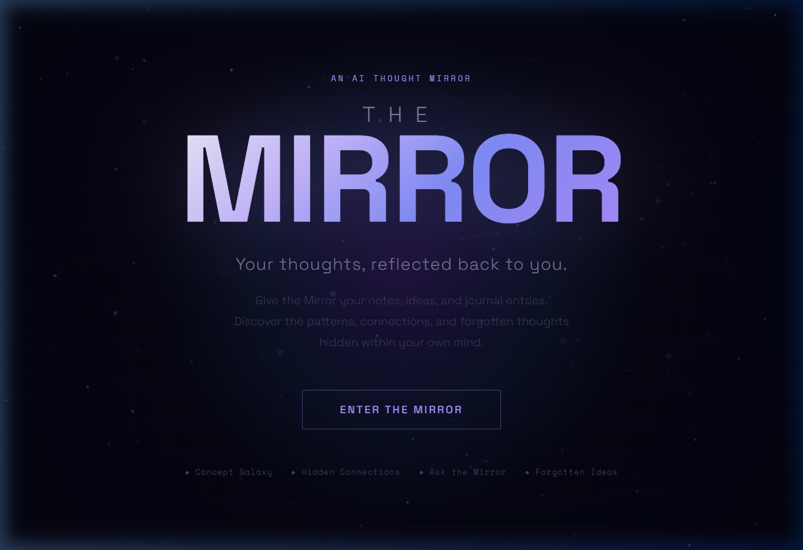
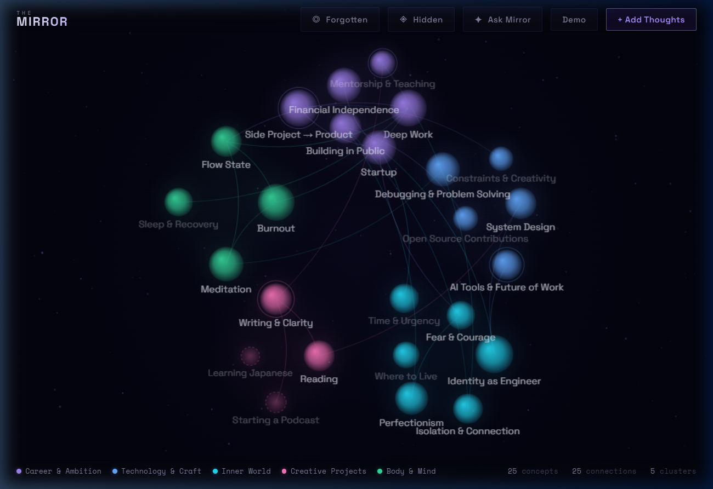
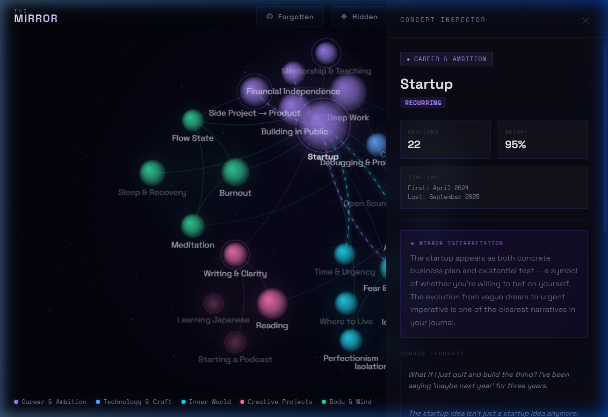

# THE MIRROR 🌌

> **Your thoughts, reflected back to you.**

An AI-powered interactive visualization that transforms unstructured notes, journal entries, and ideas into a **living constellation of your intellectual world** — built for the Anthropic Claude Hackathon.

---

## ✨ Live Demo Preview

| Landing Page | Galaxy Map | Concept Inspector |
|---|---|---|
|  |  |  |

---

## 🚀 What It Does

Give the Mirror a pile of messy thoughts — it shows you something you couldn't see yourself.

1. **Extracts** concepts, interests, goals, questions, and experiences from raw text
2. **Clusters** related concepts into thematic groups
3. **Maps** relationships between concepts as an interactive galaxy
4. **Identifies** recurring, emerging, and abandoned ideas
5. **Reveals** hidden cross-domain connections you never consciously made
6. **Answers** questions about your own intellectual landscape

---

## 🎯 Core Features

| Feature | Description |
|---|---|
| 🌌 **Mirror Map** | Interactive galaxy/constellation — concepts as stars, relationships as connections |
| 🔍 **Concept Inspector** | Click any node — see mentions, timeline, AI interpretation, source quotes |
| ✦ **Ask the Mirror** | Ask *"What have I abandoned?"* or *"What idea keeps returning?"* — AI answers with evidence |
| ◈ **Hidden Connections** | The AI finds non-obvious bridges between distant concepts |
| ◎ **Forgotten Ideas** | Highlights ideas that burned bright then quietly disappeared |
| 💫 **Demo Mode** | Built-in 18-month thought journal (84 thoughts, 25 concepts, 5 clusters) — no API key needed to explore |

---

## 🛠 Tech Stack

- **Frontend**: Vanilla HTML/CSS/JavaScript, Canvas 2D (custom galaxy renderer)
- **Backend**: Python/Flask (or Node.js/Express)
- **AI**: Claude Sonnet via Anthropic API
- **Fonts**: Space Grotesk + Space Mono (Google Fonts)
- **No framework, no build step, no auth, no database**

---

## ⚡ Quick Start

### Requirements
- Python 3.8+ (or Node.js 18+)
- An [Anthropic API key](https://console.anthropic.com)

### Run with Python

```bash
# 1. Clone the repo
git clone https://github.com/YOUR_USERNAME/the-mirror.git
cd the-mirror

# 2. Install Python deps
pip install flask flask-cors anthropic

# 3. Set your API key
set ANTHROPIC_API_KEY=sk-ant-your-key-here     # Windows
export ANTHROPIC_API_KEY=sk-ant-your-key-here  # Mac/Linux

# 4. Start the server
python server/server.py

# 5. Open http://localhost:3001
```

### Run with Node.js

```bash
cd server
npm install
# Add ANTHROPIC_API_KEY=sk-ant-... to server/.env
npm start
```

### Windows — Double Click
```
start.bat
```

### No API key? No problem.
Open the app and click **Demo** to explore the built-in galaxy immediately.

---

## 🔑 API Key Options

**Option A: Environment variable (recommended)**
```bash
set ANTHROPIC_API_KEY=sk-ant-your-key-here
```

**Option B: Browser UI**
When you click **"+ Add Thoughts"**, the app will prompt for your key. It's stored only in your browser session — never sent anywhere except Anthropic.

---

## 📁 Project Structure

```
the-mirror/
├── start.bat                 ← Windows one-click launch
├── server/
│   ├── server.py             ← Python/Flask API server
│   ├── index.js              ← Node.js/Express API server
│   └── package.json
└── public/
    ├── index.html            ← Landing page
    ├── mirror.html           ← Main galaxy visualization
    ├── css/
    │   ├── base.css          ← Design tokens
    │   ├── landing.css       ← Landing styles
    │   └── mirror.css        ← App styles
    └── js/
        ├── demo.js           ← Built-in demo dataset
        ├── canvas.js         ← Galaxy renderer
        ├── ai.js             ← AI API module (dual-mode)
        ├── inspector.js      ← Node inspector panel
        ├── chat.js           ← Ask the Mirror panel
        └── main.js           ← App orchestrator
```

---

## 🎬 3-Minute Demo Script

1. **Land** → cinematic particle screen, click *Enter the Mirror*
2. **Reveal** → galaxy animates in with 25 thought-concepts
3. **Click** "Startup" node → inspect 22 mentions, Apr 2024 → Sep 2025
4. **Ask** *"Why is Startup connected to Fear?"* → AI explains with source quotes
5. **Hidden** → click ◈ Hidden → Meditation ↔ Debugging connection revealed
6. **Forgotten** → click ◎ Forgotten → "Starting a Podcast" & "Learning Japanese" dim into view
7. **Ask** *"What have I been thinking about most?"* → AI answers live

---

## 🔒 Trust & Transparency

- Every AI-detected relationship is **explainable** with source evidence
- Clearly distinguishes: source quotes vs. AI interpretation vs. AI hypothesis
- No psychological diagnoses or unsupported personality claims
- No user accounts, no data stored, no tracking

---

## Built With

- [Anthropic Claude API](https://anthropic.com)
- [Space Grotesk Font](https://fonts.google.com/specimen/Space+Grotesk)
- Canvas 2D Web API

---

*Built at the Anthropic Claude Hackathon · September 2026*
